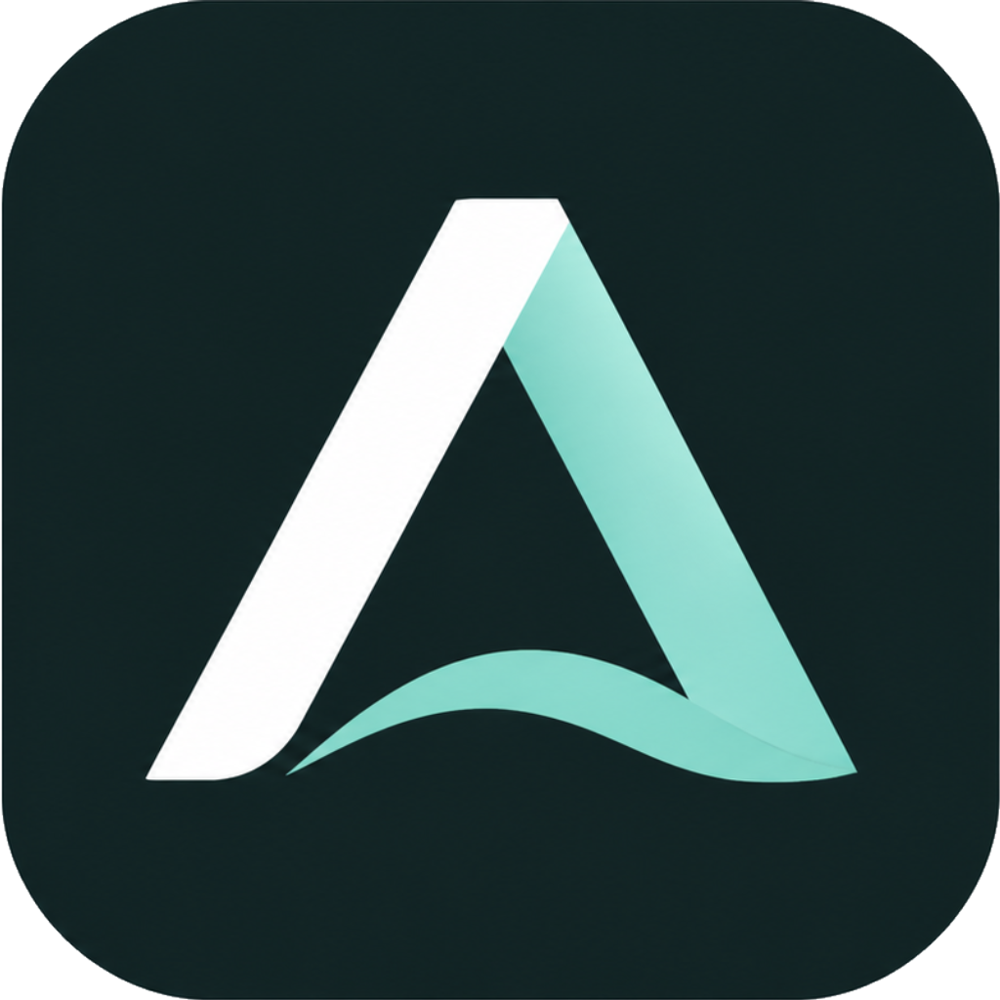
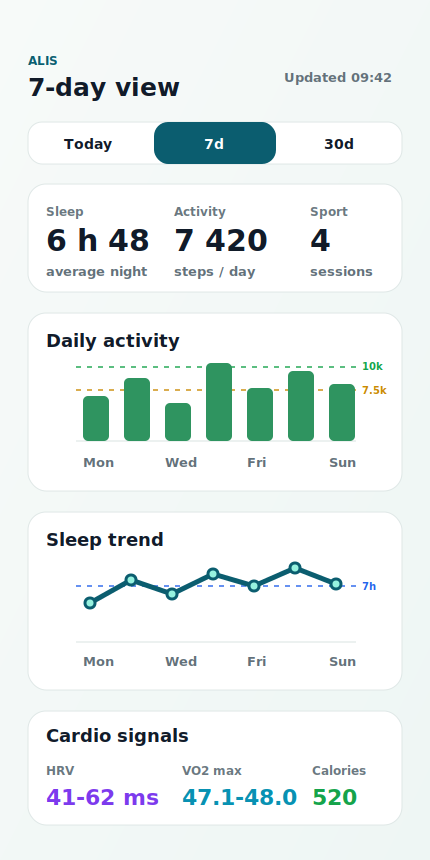

<p align="center">
  
</p>

# ALIS

**Your health agent. Open-source. Self-hosted. Your data stays yours.**

ALIS is a private health cockpit for Android that synchronizes Health Connect
data into your own backend, turns daily signals into readable dashboards,
analyzes meals from photos, and gives you an AI coach with real health context.
It is built for people who want a polished health experience without sending
their personal data to a third-party cloud.

<p align="center">
  
</p>

## Features

- **Health Connect sync**: steps, sleep, workouts, heart-rate signals, calories,
  HRV and VO2 max, with Android background synchronization.
- **Private dashboard**: today, 7-day and 30-day views with clear health,
  activity, sleep, sport and recovery summaries.
- **Nutrition analysis**: meal photo analysis, food review, validation and
  nutrition context for the coach.
- **AI coaching**: daily and weekly coaching based on your profile, workouts,
  recovery, nutrition and recent trends.
- **Self-hosted backend**: FastAPI, Postgres, processor, nutrition worker and
  web portal managed with Docker Compose.
- **No tracking by default**: no analytics, no hosted dependency, no production
  secrets in the repository.

ALIS helps you organize and understand your own health data. It is not a
medical device, does not diagnose conditions, and does not replace professional
medical advice.

## Supported Data Sources

ALIS reads health data from **Android Health Connect**. Any app that writes
compatible records to Health Connect can become a source for ALIS.

Tested or targeted sources include:

- **Google Fit / Google health ecosystem**, through Health Connect records.
- **Garmin Connect**, when Garmin syncs workouts, steps, sleep and cardio data
  into Health Connect.
- **Ultrahuman**, when the ring writes sleep, recovery and cardio signals into
  Health Connect.

Supported record families include:

- steps and daily activity;
- sleep sessions and sleep stages;
- workouts and exercise sessions;
- heart rate, resting heart rate, HRV and VO2 max;
- active calories, total calories and distance;
- weight, body temperature and blood glucose when available;
- hydration and nutrition records when available;
- ALIS nutrition entries created from meal photos and food review.

Availability depends on what each source app actually writes to Health Connect.
For example, ALIS does not need a direct Garmin or Ultrahuman cloud login; it
uses the data those apps expose locally through Health Connect.

## Supported Sports Activities

ALIS normalizes common Health Connect exercise sessions into readable training
types for the dashboard and AI coach:

- running and treadmill running;
- cycling, stationary biking and RPM / spinning;
- strength training and weight training;
- rowing / rowing machine;
- swimming, pool swimming and open-water swimming;
- walking;
- Pilates;
- other Health Connect exercise sessions as `other`.

The coach can provide richer post-workout guidance for running, cycling/RPM,
strength training, rowing and swimming when enough recent context is available.

## Repository Structure

```text
apps/mobile/       Expo / React Native Android app
apps/portal/       Web portal served by Docker
services/api/      FastAPI backend, ingestion, nutrition and coach APIs
services/processor Background processor
assets/            Brand and demo-safe product visuals
scripts/           Install and security-check scripts
docker-compose.yml Self-hosted stack
```

## Requirements

- Docker with Docker Compose V2
- Android phone with Health Connect installed
- Node.js 20+ for mobile development
- Optional: Ollama running on the host for local AI coaching and nutrition
  analysis

## Install The Self-Hosted Stack

Clone the repository:

```bash
git clone https://github.com/AnthonyHervy/ALIS-HEALTH.git
cd ALIS-HEALTH
```

Start ALIS:

```bash
chmod +x scripts/install.sh
./scripts/install.sh
```

The installer creates a local `.env` file with fresh secrets, builds the Docker
containers, applies database migrations and prints the URLs and pairing code.

Default local services:

```text
API:    http://localhost:8010
Portal: http://localhost:5174
```

The generated `.env` file is ignored by Git. Keep it private.

## Configure AI Models

ALIS expects local models through Ollama by default:

```env
HEALTH_LLM_BASE_URL=http://host.docker.internal:11434
HEALTH_LLM_MODEL=gpt-oss:20b
NUTRITION_LLM_BASE_URL=http://host.docker.internal:11434
NUTRITION_VISION_MODEL=qwen3-vl:30b
```

Edit `.env` after installation to use another model host or model name.

## Run The Android App

From the mobile app folder:

```bash
cd apps/mobile
npm install
npm test
npm run type-check
npx expo run:android
```

On a physical phone, do not use `localhost` as the API URL because it points to
the phone itself. Use your Docker host LAN or Tailscale URL instead, for
example:

```text
http://192.168.1.20:8010
```

Then enter the pairing code printed by `./scripts/install.sh` in the ALIS app.

Optional build-time defaults:

```bash
EXPO_PUBLIC_HEALTH_API_URL=http://YOUR_SERVER_IP:8010
EXPO_PUBLIC_PAIRING_CODE=YOUR_PAIRING_CODE
```

Release signing is intentionally not configured in this public export. Use your
own Android keystore when building release artifacts.

## Useful Commands

```bash
# Validate the Docker configuration with example values
docker compose --env-file .env.example config

# Run the repository security scan
./scripts/security-check.sh

# Backend tests
cd services/api
python -m pytest

# Portal checks
cd ../../apps/portal
npm install
npm test
npm run build

# Mobile checks
cd ../mobile
npm install
npm test
npm run type-check
```

## Security And Privacy

ALIS stores health observations, workouts, nutrition photos/thumbnails and coach
settings in your self-hosted Postgres database. Keep Docker volumes, database
dumps, logs, pairing codes and device tokens private.

Before publishing changes, run:

```bash
./scripts/security-check.sh
```

The script fails if it finds local secrets, private host paths, known private
IPs, Android keystores, APK/AAB artifacts or common API key patterns.

## License

ALIS is licensed under the **GNU Affero General Public License v3.0**. See
[LICENSE](./LICENSE).

The ALIS name, logo and brand assets are trademarks/brand identifiers of the
project owner and may not be used to imply endorsement or publish a competing
commercial product without permission.
